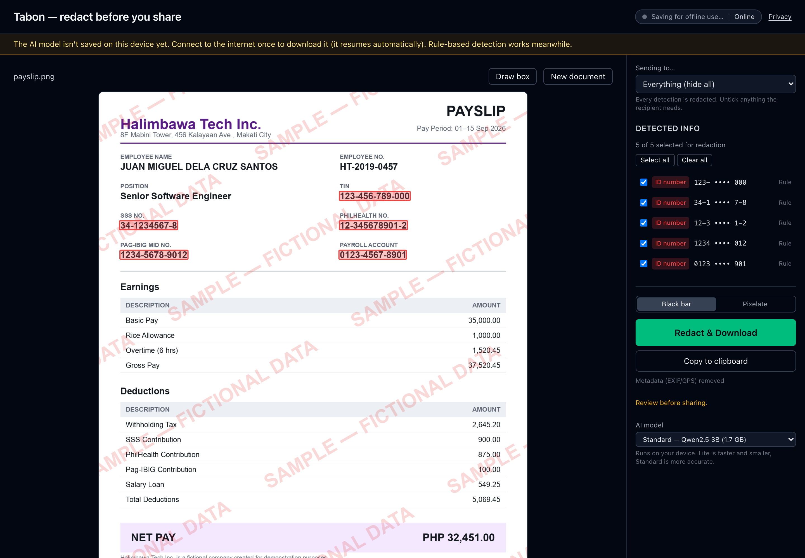

# Tabon

**Live demo: https://tabon-one.vercel.app** (Chrome 121+ with WebGPU for the AI model)

**Black out the personal info on an ID, payslip or bank statement before you send it, using AI that runs entirely in your browser. The document never leaves your device.**



<sub>Fictional payslip sample, rule-based detections only (captured with `npm run screenshot`, model download blocked). With the local AI model loaded, names and addresses are boxed too.</sub>

*Tabon* (Tagalog) means "cover" or "lid".

## The problem

Filipinos send personal documents every day: a government ID to a landlord, a payslip to a lending app, a bank statement to an embassy agent, a Meralco bill as proof of address. They go out over Messenger, Viber and email, usually as a phone photo of the whole page.

Each forward exposes far more than the recipient needs: TIN, SSS, PhilHealth and Pag-IBIG numbers, account numbers, home address, birthday, mobile number, salary. Once sent, the copy sits in chat histories, inboxes and cloud backups you don't control, and can be forwarded again. Those are the details used in identity fraud, SIM registration abuse and fake loan applications.

People rarely redact, because doing it by hand means installing an editor, finding every number, and drawing boxes that often don't actually remove the text underneath.

## Why local AI (and not a cloud API)

- **The document never leaves the device.** A cloud redactor would require uploading the exact data you're trying to protect, to a server you have to trust, before it can tell you what to hide. Tabon runs OCR (Tesseract.js) and the language model (Qwen2.5 via WebLLM on WebGPU) inside the browser tab. No document text, image or analytics is sent anywhere.
- **Works offline.** After the first visit (which downloads the app and the model once), Tabon works with Wi-Fi off: in a branch with no signal, on a plane, or on purpose.
- **₱0 per document.** No API keys, no per-call fees, no account. Redacting 1 page or 1,000 costs the same: nothing.
- **Data Privacy Act-friendly by architecture.** Under the Data Privacy Act of 2012 (RA 10173), sending someone's personal information to a third-party processor is itself something you have to justify. With Tabon there is no processor: the data stays in the browser. (This is a design property, not legal advice or a compliance certification. See [Limitations](#limitations--honesty).)

The header chip shows "Offline-ready · 0 bytes sent" once everything is cached, and the Privacy link explains how to confirm it yourself in DevTools (Network tab).

## How it works

```
 Image (PNG/JPG) or PDF page
            │   PDF pages rendered to canvas by self-hosted pdf.js
            ▼
 ┌──────────────────────────┐
 │ Tesseract.js OCR (WASM)  │  words + pixel boxes + character offsets
 └────────────┬─────────────┘
              │ full text
      ┌───────┴─────────────────────────┐
      ▼                                 ▼
 ┌──────────────────┐        ┌─────────────────────────────┐
 │ PH regex rules   │        │ Local Qwen2.5 via WebLLM    │
 │ TIN, SSS, PhilH, │        │ (WebGPU, in a Web Worker)   │
 │ Pag-IBIG, phone, │        │ names, addresses, dates,    │
 │ email, accounts… │        │ anything rules miss         │
 └────────┬─────────┘        └──────────────┬──────────────┘
          │  character spans                │  exact substrings → spans
          └───────────────┬─────────────────┘
                          ▼
            ┌─────────────────────────────┐
            │ Box matcher                 │  spans → word boxes, merge + dedupe
            └─────────────┬───────────────┘
                          ▼
            You review: toggle boxes, draw your own,
            pick a "Sending to…" preset
                          ▼
            ┌─────────────────────────────┐
            │ Flattened PNG / image-only  │  black bars (or pixelate) burned
            │ PDF, EXIF/GPS stripped      │  into the pixels; no text layer
            └─────────────────────────────┘
```

Rule-based detection shows up within seconds; the AI's extra boxes arrive when the model finishes. Without WebGPU, Tabon still works with rules only.

## Run it locally

**Prerequisites**

- Node.js 20+
- Chrome 121+ (or another browser with WebGPU enabled) for the AI model. Other browsers fall back to rule-based detection.
- About 3 GB of free disk for the model cache (Standard model 1.7 GB, Lite 0.9 GB)

**Start**

```
npm install
npm run dev
```

Open http://localhost:5173 and pick a sample (or drop your own image/PDF).

The first load downloads the AI model once in the background (progress shows in the app). After that it loads from the browser's own storage, with no network. You can switch between Standard (Qwen2.5 3B) and Lite (Qwen2.5 1.5B) in the side panel.

**Test offline**

1. Open the app once while online and wait until the header chip says **Offline-ready**.
2. Turn Wi-Fi off (or in DevTools → Network, choose **Offline**).
3. Reload the page and run a sample. OCR, rules, AI detection and export all work.
4. Optional: keep DevTools → Network open during a scan. No requests carry your document.

For the most realistic offline test, use the production build (`npm run build && npm run preview`, then open the printed URL), since the service worker that caches the app is only active there.

## Disclosures

**Runtime libraries** (versions installed from `package.json`)

| Library | Version | Used for |
|---|---|---|
| tesseract.js (+ tesseract.js-core) | 7.0.0 | In-browser OCR (WebAssembly), self-hosted under `public/tesseract/` |
| @mlc-ai/web-llm | 0.2.85 | Running the LLM in the browser on WebGPU, in a Web Worker |
| pdfjs-dist (pdf.js) | 6.4.299 | Rendering PDF pages; worker, CMaps, standard fonts (Foxit, Liberation Sans) and image-decoder wasm (OpenJPEG, JBIG2, QCMS) self-hosted under `public/pdfjs/` |
| pdf-lib | 1.17.1 | Building the "Download all pages" PDF from redacted page images only (no original text layer) |
| React / React DOM | 19.3.0 | UI |

**Models**

- **Qwen2.5-3B-Instruct** (default "Standard", Qwen Research License) and **Qwen2.5-1.5B-Instruct** ("Lite", Apache-2.0), by the Qwen team, Alibaba Cloud. Used in the MLC **q4f16_1** builds (q4f32_1 on GPUs without f16) via MLC WebLLM. Weights download once from huggingface.co/mlc-ai and WebGPU kernels from github.com/mlc-ai/binary-mlc-llm-libs (or from this machine after `npm run models`), then stay in the browser's IndexedDB.
- **Tesseract LSTM `eng.traineddata`** from tesseract-ocr/tessdata_fast (Apache-2.0), self-hosted gzipped at `public/tesseract/lang/eng.traineddata.gz`.

**Build and dev tools**

| Tool | Version | Used for |
|---|---|---|
| Vite | 8.3.4 | Dev server and build |
| TypeScript | 6.0.3 | Type checking |
| @vitejs/plugin-react | 6.1.2 | React support in Vite |
| Tailwind CSS (+ @tailwindcss/vite) | 4.3.3 | Styling |
| vite-plugin-pwa (Workbox) | 2.0.0 | Service worker that precaches the app, OCR/PDF files and samples; web app manifest |
| Vitest | 5.0.3 | Unit tests |
| oxlint | 1.87.0 | Linting |
| Playwright | 1.63.0 | `scripts/screenshot.mjs` (captures `docs/screenshot.png`, dev only) |
| Python + Pillow | | Generating the fictional sample documents (`scripts/make_samples.py`) |
| rsvg-convert (librsvg) | 2.62.3 | Rendering the app icon PNGs from `public/favicon.svg` |

**AI-assisted development:** Claude Code (Anthropic) was used to write code for this project. It is a development tool only. **No cloud AI APIs are used at runtime**: all inference happens in the user's browser.

**Original work:** no pre-existing code. The repository was created during the hackathon (Oct 9, 2026).

**Sample data:** all sample documents in `public/samples/` are fictional (invented people, numbers, addresses and companies) and watermarked "SAMPLE — FICTIONAL DATA".

## Limitations & honesty

- **OCR can miss text**, especially in blurry, dark, angled or low-resolution photos, handwriting, or unusual fonts. Anything OCR can't read can't be detected. **Always review before sharing**, and use "Draw box" to cover anything missed.
- The AI model can miss things or box things that aren't sensitive. Rules cover common PH ID formats; the model covers the rest on a best-effort basis.
- OCR is English-trained; Filipino text mostly works (same alphabet), other scripts don't.
- The AI needs WebGPU and a GPU with enough memory. Without it, only rule-based detection runs.
- Tabon is a tool to help you redact. It is **not a legal or compliance guarantee**, and not legal advice.

## Developer notes

**Commands**

```
npm run dev          # dev server on :5173
npm run build        # type-check + production build
npm run preview      # serve the build (service worker active)
npm test             # unit tests
npm run models       # optional: download the AI models into models/ once
npm run screenshot   # capture docs/screenshot.png (needs preview running and Chrome installed)
```

**Offline assets.** `npm install` runs `scripts/copy-assets.mjs`, which copies the Tesseract worker/core files into `public/tesseract/` and the pdf.js worker and data into `public/pdfjs/`. The app never loads OCR or PDF code or data from a CDN, and the service worker precaches all of it (plus `/samples/**` and the app shell).

**Models on this machine.** `npm run models` downloads the models once into `models/` (git-ignored, ~2.6 GB for both; `npm run models -- lite` for one). `vite` and `vite preview` then serve them at `/models/` and the build points the app there, so a new browser profile fills its cache from local disk. The browser cache is keyed by URL, so a model already cached from Hugging Face is fetched once more from `/models/`.

**GPU warm-up.** Right after loading, the app sends the model one short throwaway request, because the GPU's first real prompt ran several times slower than later ones.

**web-llm patch.** `npm install` also runs `scripts/patch-webllm.mjs`, a one-line patch so web-llm's IndexedDB cache checks whether weight files exist by key (`getKey`) instead of reading all 1.7 GB twice per start.

**Sample documents.** Regenerate with:

```
python3 -m venv .venv && .venv/bin/pip install pillow
.venv/bin/python scripts/make_samples.py
```

**Icons.** After editing `public/favicon.svg`:

```
rsvg-convert -w 192 -h 192 public/favicon.svg -o public/icon-192.png
rsvg-convert -w 512 -h 512 public/favicon.svg -o public/icon-512.png
```

## Team

- _TODO: names and roles_

Built for the AppBuildersPH Hackathon 2026 (theme: Local AI).

## License

[MIT](LICENSE)
